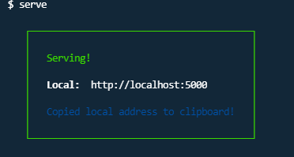
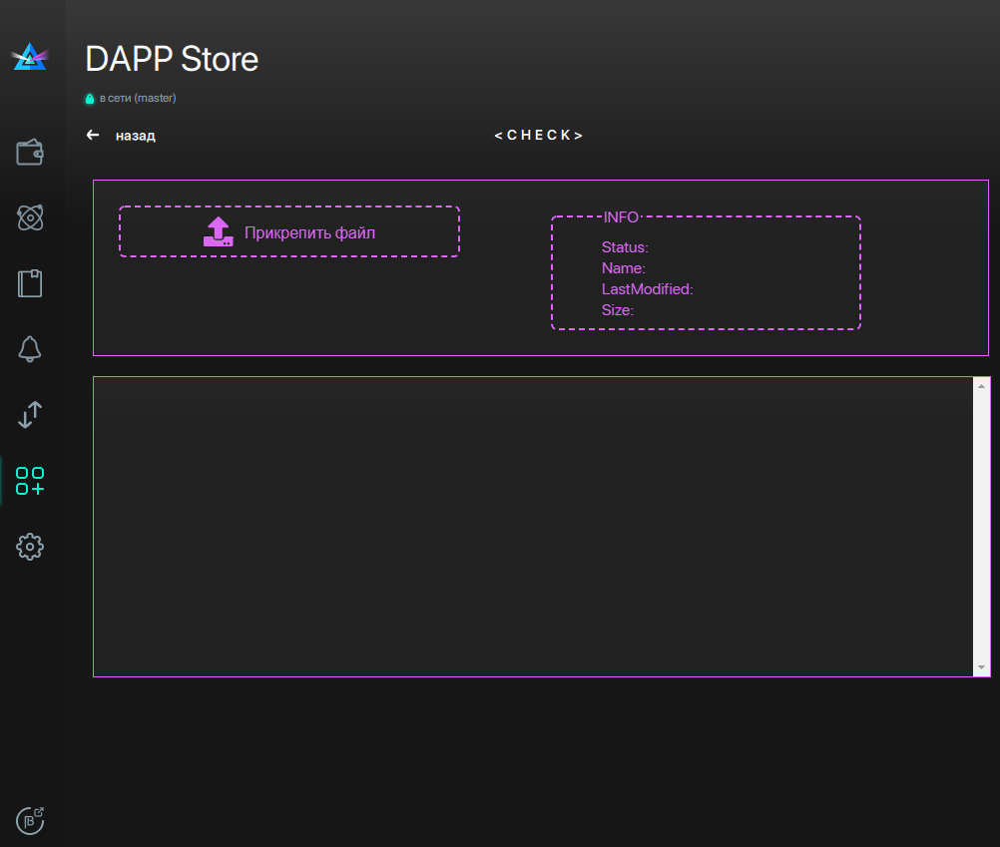

# contract-shaders-check(work in progress)

## Как начать использовать

- Сделать Fork репозитория https://github.com/JenkJS/shaders-check
- Запустить проект на локальном сервере.
    - Можно использовать любой сервер либо установить https://www.npmjs.com/package/serve 
## Как установить
   Установить Serve
  ``` 
  npm -g serve 
  ```
  or
  ``` 
  yarn -g serve 
  
  ``` 
  
  * Запустить в терминале сервер
  
  ``` 
  serve 
  ```  
   Сервер запущен!

<p align="center">
  
</p>

- В файле "setting.ini" который расположен в папке кошелька по адресу если у вас Windows

```
C:\Users\****\AppData\Local\Beam Wallet Masternet
```

нужно добавить:

```
[devapp]
url=http://localhost:5000
name=<Shaders-check>
```

где url - адресс вашего локального сервера

- Запустить кошелек и в DAPPS Store запустить приложение Shaders-check
- Перенести wasm файл в поле "Прикрепить файл" и получить ответ
<p align="center">
  
</p>
